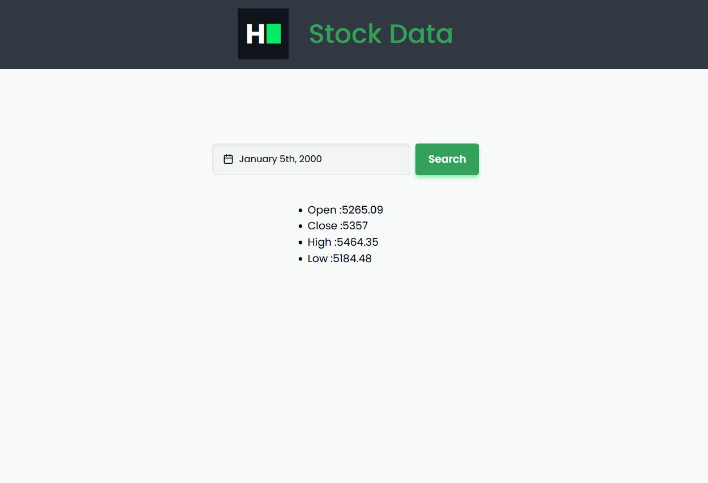

# Basyai stock api mechine task

Setup project

Step 1

clone this repository

`git clone https://github.com/mohamedaflah/basyai_stockdata_mechinetask.git`

Step 2

Install necessary dependencies

`npm install`

Step 3

Run project

`npm run dev`

# Preview
